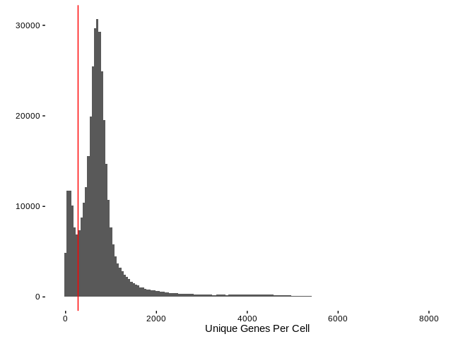

#Packages and Shared Code


```r
suppressPackageStartupMessages(library(rhdf5))
suppressPackageStartupMessages(library(DarkKinaseTools))
suppressPackageStartupMessages(library(tidyverse))
suppressPackageStartupMessages(library(BerginskiRMisc))
suppressPackageStartupMessages(library(here))
```


```r
source(here('shared_functions.R'))
```

#Data Download


```r
if (! file.exists(here('bone_marrow','ica_bone_marrow_h5.h5'))) {
  download.file('https://s3.amazonaws.com/preview-ica-expression-data/ica_bone_marrow_h5.h5',
                here('bone_marrow','ica_bone_marrow_h5.h5'))
}
```

#Data Loading

Loading this data takes some time and lots of memory (> 16 Gigs).

```r
bone_marrow = read_h5_file_to_tidy(here('bone_marrow','ica_bone_marrow_h5.h5')) %>%
  mutate(patient = gsub(".*(BM[[:digit:]]).*","\\1",barcode))
```

```
## Joining, by = "gene_index"
```


#Exploritory Data Analysis

Let's get some quick summaries of the full data set, namely the total number of mapped reads per cell and the total number of unique genes per cell.

```r
per_cell_summary  = bone_marrow %>%
  group_by(barcode) %>%
  summarise(read_count = sum(counts),
            unique_genes = n())

ggplot(per_cell_summary,aes(x=read_count)) + 
  geom_histogram(binwidth=20) + 
  theme_berginski() +
  labs(x='Read Count Sum Per Cell',y='')
```

<!-- -->
So their is a fair bit of skew in this data past the apparent double peak at the lower end of the disitribution. Let's take a closer look at the lower end of the distribution:


```r
ggplot(per_cell_summary,aes(x=read_count)) + 
  geom_histogram(binwidth=50) + 
  theme_berginski() +
  labs(x='Read Count Sum Per Cell',y='') +
  xlim(c(0,10000)) +
  geom_vline(xintercept = 800,color='red')
```

```
## Warning: Removed 17526 rows containing non-finite values (stat_bin).
```

<!-- -->

There is a clear trough at 800 total mapped reads that I've marked out in red, that will be the lower threshold to toss out cells that didn't property adhere (maybe?) to the beads. The upper boundary doesn't seem as clear to me, but there is probably some barcode sets that represent multiple cells in a single droplet. How about a max read count of 7500?

What about the unique number of genes in each barcode:


```r
ggplot(per_cell_summary,aes(x=unique_genes)) + 
  geom_histogram(binwidth=50) + 
  theme_berginski() +
  labs(x='Unique Genes Per Cell',y='') +
  geom_vline(xintercept = 275, color='red')
```

<!-- -->

I don't have a particularly compelling reason to filter on the number of unique genes found per cell, so I don't see any particular reason to filter on this value.

For good measure, let's also take a look at the binned scatterplot comparing the read counts and unique genes.


```r
ggplot(per_cell_summary,aes(x=unique_genes,y=read_count)) + 
  geom_hex() + theme_berginski() +
  labs(x='Unique Gene Count',y="Read Count Sum")
```

<!-- -->

As expected, low unique gene counts somewhat line up with the read count sum.

#Data Filtering and Results

Let's run the filtering to remove the problematic barcodes and then get out the kinase reads.


```r
bone_marrow_filt = bone_marrow %>% filter_single_cell(read_total_range = c(800,7500))

bone_marrow_kinases = bone_marrow_filt %>% filter(ensembl_gene_id %in% all_kinases$ensembl_gene_id) %>%
  left_join(all_kinases)
```

```
## Joining, by = "ensembl_gene_id"
```

```
## Warning: Column `ensembl_gene_id` joining character vector and factor,
## coercing into character vector
```

```r
bone_marrow_dark_kinases = bone_marrow_kinases %>% filter(class == "Dark")

per_kinase_stats = bone_marrow_kinases %>% group_by(gene_names,class) %>%
  summarise(total_reads = sum(counts), 
            total_cells = length(unique(barcode)), 
            read_variance = var(counts))
```

##Summary Results

Now let's run through some basic results:

* 506 unique kinases are represented in the data
* 0.64% of the mapped reads are to a kinase
* 100% of the bone marrow cells express at least one kinase
* 93% of the cells express a dark kinase


##Summary Distributions


```r
ggplot(per_kinase_stats,aes(x=total_reads,y=stat(density),color=class, fill=class)) + 
  geom_histogram(position="dodge") + theme_berginski() +
  labs(color="Kinase\nType",fill="Kinase\nType",x="Total Reads",y="Density")
```

```
## `stat_bin()` using `bins = 30`. Pick better value with `binwidth`.
```

<!-- -->


```r
ggplot(per_kinase_stats,aes(x=total_cells,y=stat(density),color=class, fill=class)) + 
  geom_histogram(position="dodge") + theme_berginski() +
  labs(color="Kinase\nType",fill="Kinase\nType",x="Total Cell Count",y="Density")
```

```
## `stat_bin()` using `bins = 30`. Pick better value with `binwidth`.
```

<!-- -->

###Most Expressed Dark Kinases


gene_names   class    total_reads   total_cells   read_variance
-----------  ------  ------------  ------------  --------------
STK17B       Dark          134686         98028       0.5151599
STK17A       Dark           70760         56210       0.3363469
PRPF4B       Dark           42197         37628       0.1403834
RIOK3        Dark           34090         30132       0.1590420
TLK1         Dark           27657         25523       0.0990351
CDK11A       Dark           25821         24177       0.0720636
CDK12        Dark           23581         21690       0.2411424
MARK3        Dark           22222         21062       0.0585021
PAN3         Dark           21182         20017       0.0628096
PRKACB       Dark           20652         19334       0.0771816

###Most Expressed Light Kinases

gene_names   class    total_reads   total_cells   read_variance
-----------  ------  ------------  ------------  --------------
STK4         Light         149934        110220       0.4349561
JAK1         Light          91856         73823       0.3073883
LCK          Light          90825         67093       0.4374227
CLK1         Light          80373         66798       0.2439065
AAK1         Light          77506         63461       0.2500252
ATM          Light          76269         62369       0.2620598
CSNK1A1      Light          58809         51224       0.1710140
PRKCB        Light          58170         47935       0.2643143
MAP3K8       Light          57538         39816       0.9426091
ROCK1        Light          53884         47740       0.1441439

##Kinase Correlations


```r
# kinase_correlations = correlate_single_cell_read_counts(bone_marrow_kinases)
# 
# saveRDS(kinase_correlations,here('bone_marrow','bone_marrow_kinase_correlations.rds'))
```
