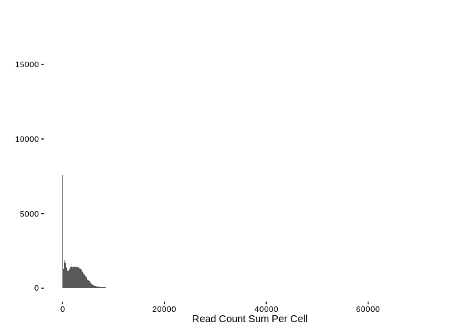
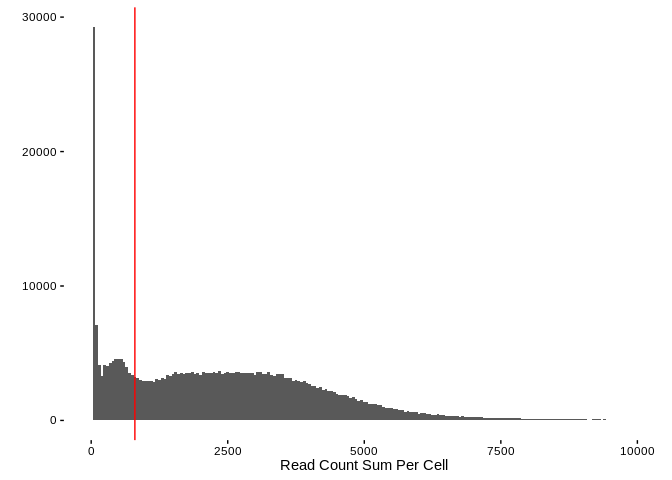
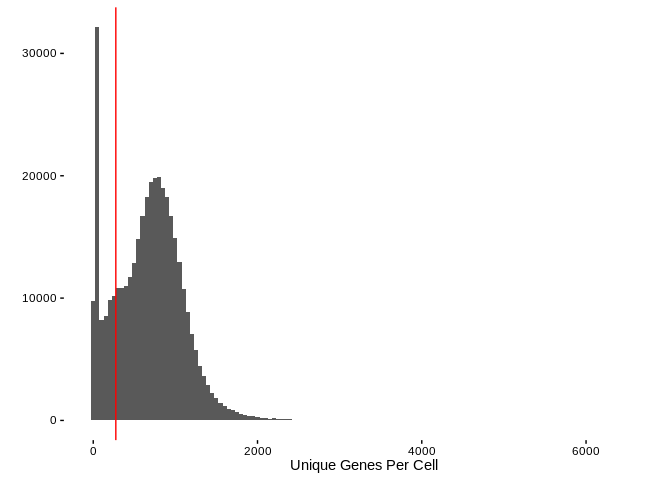
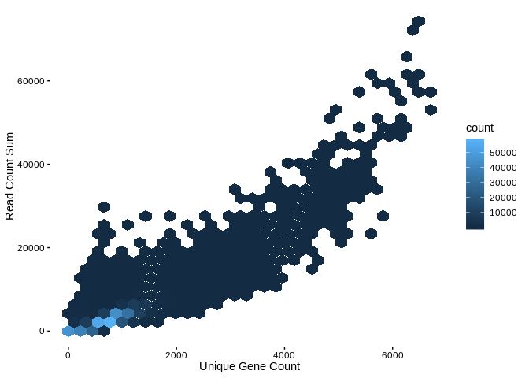
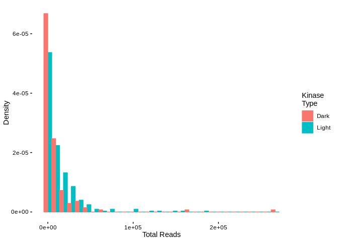
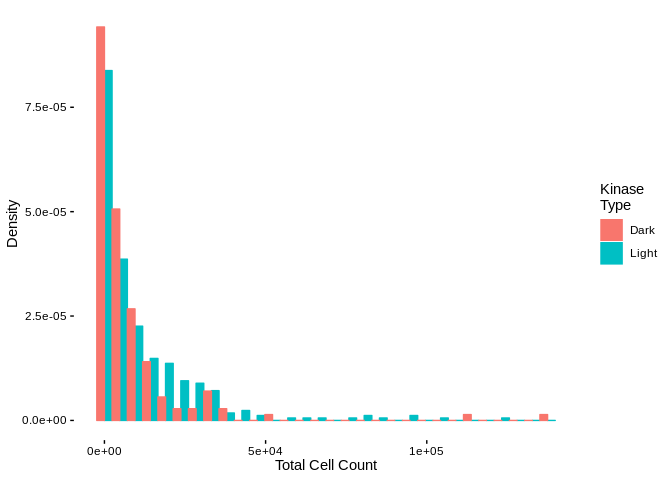
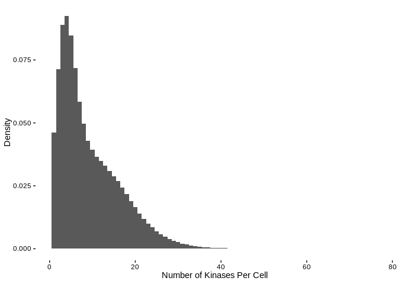
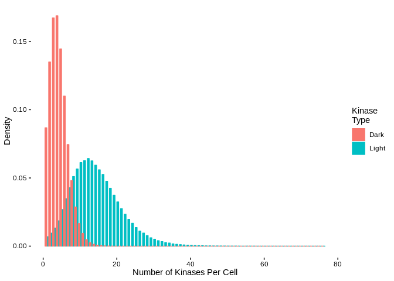

HCA - Cord Blood Analysis
================

Packages and Shared Code
========================

``` r
suppressPackageStartupMessages(library(rhdf5))
suppressPackageStartupMessages(library(DarkKinaseTools))
suppressPackageStartupMessages(library(tidyverse))
suppressPackageStartupMessages(library(BerginskiRMisc))
suppressPackageStartupMessages(library(here))
```

``` r
source(here('shared_functions.R'))
```

Data Download
=============

``` r
if (! file.exists(here('cord_blood','ica_cord_blood_h5.h5'))) {
  download.file('https://s3.amazonaws.com/preview-ica-expression-data/ica_cord_blood_h5.h5',
                here('cord_blood','ica_cord_blood_h5.h5'))
}
```

Data Loading
============

Loading this data takes some time and lots of memory (&gt; 16 Gigs).

``` r
cord_blood = read_h5_file_to_tidy(here('cord_blood','ica_cord_blood_h5.h5')) %>%
  mutate(patient = gsub(".*(CB[[:digit:]]).*","\\1",barcode))
```

    ## Joining, by = "gene_index"

Exploritory Data Analysis
=========================

Let's get some quick summaries of the full data set, namely the total number of mapped reads per cell and the total number of unique genes per cell.

``` r
per_cell_summary  = cord_blood %>%
  group_by(barcode) %>%
  summarise(read_count = sum(counts),
            unique_genes = n())

ggplot(per_cell_summary,aes(x=read_count)) + 
  geom_histogram(binwidth=20) + 
  theme_berginski() +
  labs(x='Read Count Sum Per Cell',y='')
```



So there is a fair bit of skew in this data past the apparent double peak at the lower end of the disitribution. Let's take a closer look at the lower end of the distribution:

``` r
ggplot(per_cell_summary,aes(x=read_count)) + 
  geom_histogram(binwidth=50) + 
  theme_berginski() +
  labs(x='Read Count Sum Per Cell',y='') +
  xlim(c(0,10000)) +
  geom_vline(xintercept = 800,color='red')
```

    ## Warning: Removed 2771 rows containing non-finite values (stat_bin).



There is a clear trough at 800 total mapped reads that I've marked out in red, that will be the lower threshold to toss out cells that didn't property adhere (maybe?) to the beads. The upper boundary doesn't seem as clear to me, but there is probably some barcode sets that represent multiple cells in a single droplet. How about a max read count of 7500?

What about the unique number of genes in each barcode:

``` r
ggplot(per_cell_summary,aes(x=unique_genes)) + 
  geom_histogram(binwidth=50) + 
  theme_berginski() +
  labs(x='Unique Genes Per Cell',y='') +
  geom_vline(xintercept = 275, color='red')
```



I don't have a particularly compelling reason to filter on the number of unique genes found per cell, so I don't see any particular reason to filter on this value.

For good measure, let's also take a look at the binned scatterplot comparing the read counts and unique genes.

``` r
ggplot(per_cell_summary,aes(x=unique_genes,y=read_count)) + 
  geom_hex() + theme_berginski() +
  labs(x='Unique Gene Count',y="Read Count Sum")
```



As expected, low unique gene counts somewhat line up with the read count sum.

Data Filtering and Results
==========================

Let's run the filtering to remove the problematic barcodes and then get out the kinase reads.

``` r
cord_blood_filt = cord_blood %>% filter_single_cell(read_total_range = c(800,7500))

cord_blood_kinases = cord_blood_filt %>% filter(ensembl_gene_id %in% all_kinases$ensembl_gene_id) %>%
  left_join(all_kinases)
```

    ## Joining, by = "ensembl_gene_id"

    ## Warning: Column `ensembl_gene_id` joining character vector and factor,
    ## coercing into character vector

``` r
cord_blood_dark_kinases = cord_blood_kinases %>% filter(class == "Dark")
cord_blood_light_kinases = cord_blood_kinases %>% filter(class == "Light")

per_kinase_stats = cord_blood_kinases %>% group_by(gene_names,class) %>%
  summarise(total_reads = sum(counts), 
            total_cells = length(unique(barcode)), 
            read_variance = var(counts))

per_cell_stats = cord_blood_kinases %>% group_by(barcode,class) %>%
  summarise(num_kinases = length(unique(gene_names)),
            total_kinase_reads = sum(counts))
```

Summary Results
---------------

Now let's run through some basic results:

-   505 unique kinases are represented in the data
-   0.71% of the mapped reads are to a kinase
-   100% of the cells express at least one kinase
-   96% of the cells express a dark kinase

Summary Distributions
---------------------

### Per Kinase Plots

I've summed up the total number of reads for each of the kinases across all of the cells in the filtered data set. Let's take a look at the distribution of the summed read counts splitting on the Dark/Light kinase sets.

``` r
ggplot(per_kinase_stats,aes(x=total_reads,y=stat(density),color=class, fill=class)) + 
  geom_histogram(position="dodge") + theme_berginski() +
  labs(color="Kinase\nType",fill="Kinase\nType",x="Total Reads",y="Density")
```

    ## `stat_bin()` using `bins = 30`. Pick better value with `binwidth`.



I've also figured out how many cells express each given kinase. For reference, there are 283019 cells in the data set.

``` r
ggplot(per_kinase_stats,aes(x=total_cells,y=stat(density),color=class, fill=class)) + 
  geom_histogram(position="dodge") + theme_berginski() +
  labs(color="Kinase\nType",fill="Kinase\nType",x="Total Cell Count",y="Density")
```

    ## `stat_bin()` using `bins = 30`. Pick better value with `binwidth`.



### Per Kinase Plots

Another question involves looking at the expressed kinases per cell, namely how many of the kinases are present in each cell. For reference, the median cell expresses 7 kinases.

``` r
ggplot(per_cell_stats,aes(x=num_kinases,y=stat(density))) + 
  geom_histogram(position="dodge",binwidth=1) + theme_berginski() +
  labs(color="Kinase\nType",fill="Kinase\nType",x="Number of Kinases Per Cell",y="Density")
```



OK, what about the Dark/Light split? The following plot is the same as above, except with the dark/light kinases split into seperate columns. For reference, the median number of dark kinases per cell is 4, while the median number of light kinases is 13.

``` r
ggplot(per_cell_stats,aes(x=num_kinases,y=stat(density),color=class,fill=class)) + 
  geom_histogram(position="dodge",binwidth=1) + theme_berginski() +
  labs(color="Kinase\nType",fill="Kinase\nType",x="Number of Kinases Per Cell",y="Density")
```



### Most Expressed Dark Kinases

| gene\_names | class |  total\_reads|  total\_cells|  read\_variance|
|:------------|:------|-------------:|-------------:|---------------:|
| STK17A      | Dark  |        266363|        137473|       1.6666167|
| STK17B      | Dark  |        162852|        112985|       0.5804515|
| PRPF4B      | Dark  |         63284|         53489|       0.2130445|
| RIOK3       | Dark  |         46033|         39190|       0.2320074|
| MKNK2       | Dark  |         45000|         38290|       0.2296777|
| CDK11A      | Dark  |         37004|         33874|       0.0976821|
| MARK3       | Dark  |         36241|         33400|       0.0899831|
| CDK12       | Dark  |         36004|         31602|       0.8299998|
| HIPK1       | Dark  |         35898|         32590|       0.1121307|
| CLK3        | Dark  |         33183|         30850|       0.0796969|

### Most Expressed Light Kinases

| gene\_names | class |  total\_reads|  total\_cells|  read\_variance|
|:------------|:------|-------------:|-------------:|---------------:|
| STK4        | Light |        182320|        123525|       0.6215469|
| LCK         | Light |        158178|         95457|       1.0458591|
| CLK1        | Light |        143878|        103528|       0.5732959|
| ATM         | Light |        131941|         95004|       0.4939435|
| JAK1        | Light |        115838|         86216|       0.4374471|
| CAMK4       | Light |        103991|         75278|       0.4714204|
| CSNK1A1     | Light |        102200|         81974|       0.2827944|
| AAK1        | Light |        101953|         78404|       0.3608784|
| BRD2        | Light |         76450|         63213|       0.2513626|
| ROCK1       | Light |         75514|         64002|       0.2011741|

Kinase Correlations
-------------------

I wrote a bit of code to do cross-correlation analysis on the expression levels of each of the kinases compared with one another, but I don't really know what to do with it. It's also time consuming, so I've commented it out.

``` r
kinase_correlations = correlate_single_cell_read_counts(cord_blood_kinases)
```

    ## [1] 1
    ## [1] 2
    ## [1] 3
    ## [1] 4
    ## [1] 5
    ## [1] 6
    ## [1] 7
    ## [1] 8
    ## [1] 9
    ## [1] 10
    ## [1] 11
    ## [1] 12
    ## [1] 13
    ## [1] 14
    ## [1] 15
    ## [1] 16
    ## [1] 17
    ## [1] 18
    ## [1] 19
    ## [1] 20
    ## [1] 21
    ## [1] 22
    ## [1] 23
    ## [1] 24
    ## [1] 25
    ## [1] 26
    ## [1] 27
    ## [1] 28
    ## [1] 29
    ## [1] 30
    ## [1] 31
    ## [1] 32
    ## [1] 33
    ## [1] 34
    ## [1] 35
    ## [1] 36
    ## [1] 37
    ## [1] 38
    ## [1] 39
    ## [1] 40
    ## [1] 41
    ## [1] 42
    ## [1] 43
    ## [1] 44
    ## [1] 45
    ## [1] 46
    ## [1] 47
    ## [1] 48
    ## [1] 49
    ## [1] 50
    ## [1] 51
    ## [1] 52
    ## [1] 53
    ## [1] 54
    ## [1] 55
    ## [1] 56
    ## [1] 57
    ## [1] 58
    ## [1] 59
    ## [1] 60
    ## [1] 61
    ## [1] 62
    ## [1] 63
    ## [1] 64
    ## [1] 65
    ## [1] 66
    ## [1] 67
    ## [1] 68
    ## [1] 69
    ## [1] 70
    ## [1] 71
    ## [1] 72
    ## [1] 73
    ## [1] 74
    ## [1] 75
    ## [1] 76
    ## [1] 77
    ## [1] 78
    ## [1] 79
    ## [1] 80
    ## [1] 81
    ## [1] 82
    ## [1] 83
    ## [1] 84
    ## [1] 85
    ## [1] 86
    ## [1] 87
    ## [1] 88
    ## [1] 89
    ## [1] 90
    ## [1] 91
    ## [1] 92
    ## [1] 93
    ## [1] 94
    ## [1] 95
    ## [1] 96
    ## [1] 97
    ## [1] 98
    ## [1] 99
    ## [1] 100
    ## [1] 101
    ## [1] 102
    ## [1] 103
    ## [1] 104
    ## [1] 105
    ## [1] 106
    ## [1] 107
    ## [1] 108
    ## [1] 109
    ## [1] 110
    ## [1] 111
    ## [1] 112
    ## [1] 113
    ## [1] 114
    ## [1] 115
    ## [1] 116
    ## [1] 117
    ## [1] 118
    ## [1] 119
    ## [1] 120
    ## [1] 121
    ## [1] 122
    ## [1] 123
    ## [1] 124
    ## [1] 125
    ## [1] 126
    ## [1] 127
    ## [1] 128
    ## [1] 129
    ## [1] 130
    ## [1] 131
    ## [1] 132
    ## [1] 133
    ## [1] 134
    ## [1] 135
    ## [1] 136
    ## [1] 137
    ## [1] 138
    ## [1] 139
    ## [1] 140
    ## [1] 141
    ## [1] 142
    ## [1] 143
    ## [1] 144
    ## [1] 145
    ## [1] 146
    ## [1] 147
    ## [1] 148
    ## [1] 149
    ## [1] 150
    ## [1] 151
    ## [1] 152
    ## [1] 153
    ## [1] 154
    ## [1] 155
    ## [1] 156
    ## [1] 157
    ## [1] 158
    ## [1] 159
    ## [1] 160
    ## [1] 161
    ## [1] 162
    ## [1] 163
    ## [1] 164
    ## [1] 165
    ## [1] 166
    ## [1] 167
    ## [1] 168
    ## [1] 169
    ## [1] 170
    ## [1] 171
    ## [1] 172
    ## [1] 173
    ## [1] 174
    ## [1] 175
    ## [1] 176
    ## [1] 177
    ## [1] 178
    ## [1] 179
    ## [1] 180
    ## [1] 181
    ## [1] 182
    ## [1] 183
    ## [1] 184
    ## [1] 185
    ## [1] 186
    ## [1] 187
    ## [1] 188
    ## [1] 189
    ## [1] 190
    ## [1] 191
    ## [1] 192
    ## [1] 193
    ## [1] 194
    ## [1] 195
    ## [1] 196
    ## [1] 197
    ## [1] 198
    ## [1] 199
    ## [1] 200
    ## [1] 201
    ## [1] 202
    ## [1] 203
    ## [1] 204
    ## [1] 205
    ## [1] 206
    ## [1] 207
    ## [1] 208
    ## [1] 209
    ## [1] 210
    ## [1] 211
    ## [1] 212
    ## [1] 213
    ## [1] 214
    ## [1] 215
    ## [1] 216
    ## [1] 217
    ## [1] 218
    ## [1] 219
    ## [1] 220
    ## [1] 221
    ## [1] 222
    ## [1] 223
    ## [1] 224
    ## [1] 225
    ## [1] 226
    ## [1] 227
    ## [1] 228
    ## [1] 229
    ## [1] 230
    ## [1] 231
    ## [1] 232
    ## [1] 233
    ## [1] 234
    ## [1] 235
    ## [1] 236
    ## [1] 237
    ## [1] 238
    ## [1] 239
    ## [1] 240
    ## [1] 241
    ## [1] 242
    ## [1] 243
    ## [1] 244
    ## [1] 245
    ## [1] 246
    ## [1] 247
    ## [1] 248
    ## [1] 249
    ## [1] 250
    ## [1] 251
    ## [1] 252
    ## [1] 253
    ## [1] 254
    ## [1] 255
    ## [1] 256
    ## [1] 257
    ## [1] 258
    ## [1] 259
    ## [1] 260
    ## [1] 261
    ## [1] 262
    ## [1] 263
    ## [1] 264
    ## [1] 265
    ## [1] 266
    ## [1] 267
    ## [1] 268
    ## [1] 269
    ## [1] 270
    ## [1] 271
    ## [1] 272
    ## [1] 273
    ## [1] 274
    ## [1] 275
    ## [1] 276
    ## [1] 277
    ## [1] 278
    ## [1] 279
    ## [1] 280
    ## [1] 281
    ## [1] 282
    ## [1] 283
    ## [1] 284
    ## [1] 285
    ## [1] 286
    ## [1] 287
    ## [1] 288
    ## [1] 289
    ## [1] 290
    ## [1] 291
    ## [1] 292
    ## [1] 293
    ## [1] 294
    ## [1] 295
    ## [1] 296
    ## [1] 297
    ## [1] 298
    ## [1] 299
    ## [1] 300
    ## [1] 301
    ## [1] 302
    ## [1] 303
    ## [1] 304
    ## [1] 305
    ## [1] 306
    ## [1] 307
    ## [1] 308
    ## [1] 309
    ## [1] 310
    ## [1] 311
    ## [1] 312
    ## [1] 313
    ## [1] 314
    ## [1] 315
    ## [1] 316
    ## [1] 317
    ## [1] 318
    ## [1] 319
    ## [1] 320
    ## [1] 321
    ## [1] 322
    ## [1] 323
    ## [1] 324
    ## [1] 325
    ## [1] 326
    ## [1] 327
    ## [1] 328
    ## [1] 329
    ## [1] 330
    ## [1] 331
    ## [1] 332
    ## [1] 333
    ## [1] 334
    ## [1] 335
    ## [1] 336
    ## [1] 337
    ## [1] 338
    ## [1] 339
    ## [1] 340
    ## [1] 341
    ## [1] 342
    ## [1] 343
    ## [1] 344
    ## [1] 345
    ## [1] 346
    ## [1] 347
    ## [1] 348
    ## [1] 349
    ## [1] 350
    ## [1] 351
    ## [1] 352
    ## [1] 353
    ## [1] 354
    ## [1] 355
    ## [1] 356
    ## [1] 357
    ## [1] 358
    ## [1] 359
    ## [1] 360
    ## [1] 361
    ## [1] 362
    ## [1] 363
    ## [1] 364
    ## [1] 365
    ## [1] 366
    ## [1] 367
    ## [1] 368
    ## [1] 369
    ## [1] 370
    ## [1] 371
    ## [1] 372
    ## [1] 373
    ## [1] 374
    ## [1] 375
    ## [1] 376
    ## [1] 377
    ## [1] 378
    ## [1] 379
    ## [1] 380
    ## [1] 381
    ## [1] 382
    ## [1] 383
    ## [1] 384
    ## [1] 385
    ## [1] 386
    ## [1] 387
    ## [1] 388
    ## [1] 389
    ## [1] 390
    ## [1] 391
    ## [1] 392
    ## [1] 393
    ## [1] 394
    ## [1] 395
    ## [1] 396
    ## [1] 397
    ## [1] 398
    ## [1] 399
    ## [1] 400
    ## [1] 401
    ## [1] 402
    ## [1] 403
    ## [1] 404
    ## [1] 405
    ## [1] 406
    ## [1] 407
    ## [1] 408
    ## [1] 409
    ## [1] 410
    ## [1] 411
    ## [1] 412
    ## [1] 413
    ## [1] 414
    ## [1] 415
    ## [1] 416
    ## [1] 417
    ## [1] 418
    ## [1] 419
    ## [1] 420
    ## [1] 421
    ## [1] 422
    ## [1] 423
    ## [1] 424
    ## [1] 425
    ## [1] 426
    ## [1] 427
    ## [1] 428
    ## [1] 429
    ## [1] 430
    ## [1] 431
    ## [1] 432
    ## [1] 433
    ## [1] 434
    ## [1] 435
    ## [1] 436
    ## [1] 437
    ## [1] 438
    ## [1] 439
    ## [1] 440
    ## [1] 441
    ## [1] 442
    ## [1] 443
    ## [1] 444
    ## [1] 445
    ## [1] 446
    ## [1] 447
    ## [1] 448
    ## [1] 449
    ## [1] 450
    ## [1] 451
    ## [1] 452
    ## [1] 453
    ## [1] 454
    ## [1] 455
    ## [1] 456
    ## [1] 457
    ## [1] 458
    ## [1] 459
    ## [1] 460
    ## [1] 461
    ## [1] 462
    ## [1] 463
    ## [1] 464
    ## [1] 465
    ## [1] 466
    ## [1] 467
    ## [1] 468
    ## [1] 469
    ## [1] 470
    ## [1] 471
    ## [1] 472
    ## [1] 473
    ## [1] 474
    ## [1] 475
    ## [1] 476
    ## [1] 477
    ## [1] 478
    ## [1] 479
    ## [1] 480
    ## [1] 481
    ## [1] 482
    ## [1] 483
    ## [1] 484
    ## [1] 485
    ## [1] 486
    ## [1] 487
    ## [1] 488
    ## [1] 489
    ## [1] 490
    ## [1] 491
    ## [1] 492
    ## [1] 493
    ## [1] 494
    ## [1] 495
    ## [1] 496
    ## [1] 497
    ## [1] 498
    ## [1] 499
    ## [1] 500
    ## [1] 501
    ## [1] 502
    ## [1] 503
    ## [1] 504

``` r
saveRDS(kinase_correlations,here('cord_blood','cord_blood_kinase_correlations.rds'))
```
